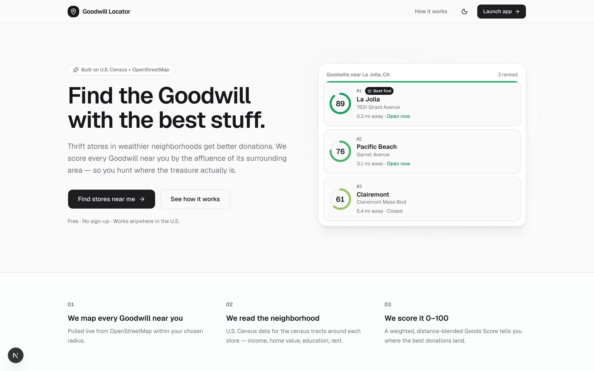
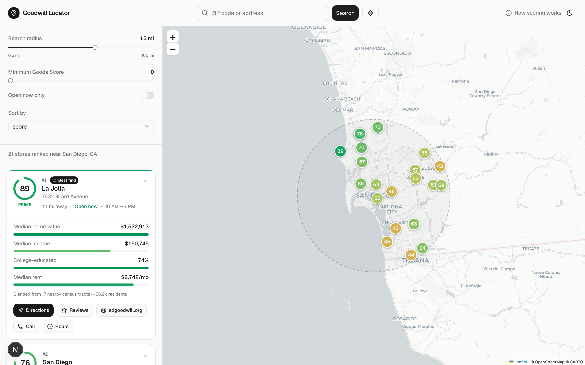
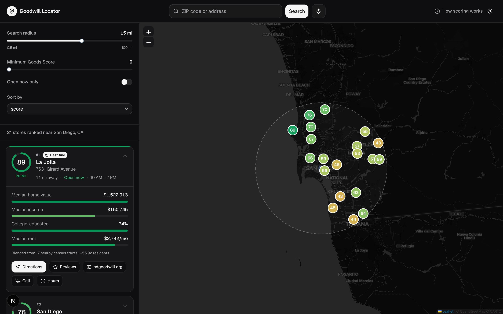

<div align="center">

# 🛍️ Thriftly

### Find the Goodwill with the best stuff.

Thrift stores in wealthier neighborhoods get better donations. **Thriftly** ranks every
Goodwill near you `0–100` by how well-off its surrounding area is, so you know where the good stuff
lands.

[**▶ Live → thriftly.xyz**](https://thriftly.xyz)


[](https://buymeacoffee.com/flanmorrison)



</div>

---

## Contents

- [The idea](#the-idea)
- [How the Goods Score works](#how-the-goods-score-works)
- [Features](#features)
- [Architecture](#architecture)
- [Tech stack](#tech-stack)
- [Design system](#design-system)
- [Data sources](#data-sources)
- [Project structure](#project-structure)
- [Getting started](#getting-started)
- [Testing](#testing)
- [Scripts](#scripts)
- [Deployment](#deployment)
- [Security](#security)
- [Engineering learnings & gotchas](#engineering-learnings--gotchas)
- [Limitations](#limitations)
- [Support & license](#support--license)

| Locator - light | Locator - dark |
| :---: | :---: |
|  |  |

---

## The idea

A Goodwill is only as good as what gets dropped off, and donations skew with local wealth. Rather
than guessing, Thriftly quantifies it: for every nearby store it pulls the demographics of the
**census tracts within ~3 miles**, blends them by population and distance, and produces a single,
explainable **Goods Score (0–100)**.

The product is intentionally focused - it scores *donation quality from neighborhood affluence*, not
store reviews or live inventory. (Reviews are one tap away via a per-store Google link, but are
deliberately kept out of the score; see [learnings](#engineering-learnings--gotchas).)

## How the Goods Score works

For each store we build a **catchment**: every census tract whose centroid is within
`CATCHMENT_RADIUS_MILES` (3 mi) of the store, weighted by `population × 1/(distanceMiles + 0.5)`.
The blended catchment is scored on four affluence signals, each normalized into a national range and
combined with fixed, documented weights:

| Factor | Weight | ACS source | Normalization |
| --- | :---: | --- | --- |
| Median home value | **40%** | `B25077` | log-scaled, $100k → $1.5M |
| Median household income | **35%** | `B19013` | linear, $25k → $200k |
| % bachelor's degree or higher | **15%** | `S1501_C02_015E` | linear, 0% → 70% |
| Median gross rent | **10%** | `B25064` | linear, $700 → $3,000 |

```
GoodsScore = Σ (normalizedFactor × weight)   →   0..100
```

**Two-axis design.** Distance is deliberately *not* folded into the headline score - it's shown
separately and offered as a "Best nearby" sort (score minus a mild distance penalty). This keeps
"great stuff" honest and distinct from "close to me."

**Tiers** (label conveys meaning without relying on color alone): `≥82 Prime`, `≥68 Excellent`,
`≥52 Strong`, `≥36 Fair`, else `Lean`.

Weights and ranges live in `lib/reference-ranges.ts` (single source of truth). The breakdown panel on
every card exposes each factor's raw value, its normalized bar, and the catchment size, so the score
is never a black box. The methodology popover (`components/methodology.tsx`) explains it in-app.

## Features

- **Data-driven ranking** - transparent 0–100 Goods Score with a per-factor breakdown.
- **Live map** - color-graded score pins, the search radius drawn as a dashed circle, a "you are here"
  center marker, fly-to on selection, and light/dark CARTO tiles.
- **"Search this area"** - pan the map and re-search the new center at the same radius.
- **Actionable cards** - Directions (Google Maps), Reviews (Google place), Website, Call, and parsed
  **store hours** with a live "Open now" indicator. Cards expand/collapse; map ↔ list selection syncs.
- **Live address/ZIP autocomplete** (Photon), plus "use my location" and auto-geolocation on load.
- **Reverse-geocoded area label** ("21 stores ranked near San Diego, CA").
- **Robust filters** - radius 0.5–100 mi (smooth, non-linear slider), minimum score, open-now, three sorts.
- **Dark mode** - system-aware with a manual toggle.
- **Accessible** - keyboard-navigable cards, ARIA labels, contrast-aware map pins, `prefers-reduced-motion`.
- **Responsive** - desktop split (filters + list / map); mobile tabs + bottom-sheet filters.

## Architecture

On-demand server orchestration with aggressive caching. One Route Handler fans out to free/open
sources, blends each store's catchment, scores it with pure logic, and returns a ranked list.

```
Browser (/search) ──(lat,lon,radius,filters)──▶ /api/stores  (server-only)
                                                     │
   ┌──────────────┬───────────────┬─────────────────┼───────────────┐
   ▼              ▼               ▼                 ▼               ▼
 lib/overpass  lib/geocode    lib/census       lib/gazetteer    lib/scoring
 (OSM stores) (point→state)  (county ACS)     (tract centroids) (pure, tested)
   │              │               │                 │               │
   └──────────────┴──────▶ lib/catchment (radius select + weight) ──▶ ScoredStore[] ▶ client
```

Other routes: `/api/geocode` (address → lat/lon), `/api/reverse` (lat/lon → place label),
`/api/suggest` (autocomplete). Upstream calls are cached via the Next Data Cache
(`fetch(..., { next: { revalidate } })`); tract centroids are read once from a bundled dataset and
memoized in module scope.

**Pure, unit-tested core** (no I/O): `scoring`, `catchment`, `distance`, `hours`, `filters`,
`score-color`. **Data clients** (`overpass`, `census`, `geocode`, `gazetteer`) are tested with mocked
`fetch`. The client is a single `useStores` hook + presentational components. The full scoring
orchestration lives in `lib/locate.ts`, shared by `/api/stores` and the server-rendered city pages.

## SEO & local pages

Thriftly is built to rank for "best goodwill in <city>" searches, not only to work once you arrive.

- **City landing pages** - `/goodwill/[slug]` (e.g. `/goodwill/san-diego-ca`) server-render the ranked
  Goodwills for a metro, with a localized title/description, an `ItemList` + `BreadcrumbList` + `FAQPage`
  in JSON-LD, and a CTA that deep-links into `/search` at that location. They are ISR (`revalidate`
  daily, `dynamicParams`), so `next build` makes no upstream calls and the first crawl warms the cache.
  Curated metros live in `lib/metros.ts`.
- **City hub** - `/goodwill` lists every metro; the landing page adds a "Browse by city" strip. Both
  feed crawl discovery and internal-link equity.
- **Metadata** - title template, keywords, canonical URLs, robots, and Open Graph / Twitter on every
  route (`app/layout.tsx`, per-page `metadata`, `app/search/layout.tsx`).
- **Generated assets** - `app/robots.ts`, `app/sitemap.ts` (core routes + every metro), `app/manifest.ts`,
  and dynamic Open Graph images via `next/og` (`app/opengraph-image.tsx` + per-city
  `app/goodwill/[slug]/opengraph-image.tsx`).
- **Structured data** - site-wide `WebSite` / `Organization` / `WebApplication`, emitted through a
  hardened `<JsonLd>` helper (`components/json-ld.tsx`) that escapes `<` to prevent script breakout.

## Tech stack

**Next.js 16** (App Router) · **TypeScript** · **Tailwind CSS v4** · **shadcn/ui** (built on **Base UI**) ·
**react-leaflet 5** + **Leaflet** + CARTO/OpenStreetMap tiles · **lucide-react** · **next-themes** ·
**Vitest** · **Playwright** · deployed on **Vercel**.

## Design system

A clean, modern, Vercel/Notion-grade aesthetic. All tokens are CSS variables in `app/globals.css`,
mapped into Tailwind via `@theme inline`.

### Typography
- **Geist Sans** (`--font-geist-sans`) for everything; **Geist Mono** (`--font-geist-mono`) is available.
- Data figures use `font-variant-numeric: tabular-nums` (the `.tabular` utility) to prevent layout shift.
- No serif/display face - deliberately restrained.

### Color (OKLCH)
Light theme (`:root`):

| Token | Value | Use |
| --- | --- | --- |
| `--background` | `oklch(0.985 0.0015 286)` | app surface (cool near-white) |
| `--card` / `--popover` | `oklch(1 0 0)` | cards, popovers (pure white) |
| `--foreground` | `oklch(0.21 0.006 286)` | text (near-black) |
| `--muted-foreground` | `oklch(0.552 0.0145 286)` | secondary text |
| `--primary` | `oklch(0.235 0.006 286)` | buttons (near-black, Vercel-style) |
| `--border` / `--input` | `oklch(0.918 0.004 286)` | hairlines |
| `--ring` | `oklch(0.55 0.04 250)` | focus ring |
| `--brand` | `oklch(0.58 0.13 158)` | emerald accent (e.g. "Open now") |
| `--radius` | `0.75rem` | base radius |

Dark theme (`.dark`) mirrors these with a near-black `--background: oklch(0.165 0.004 286)` and lifted
foregrounds. Dark mode is driven by `next-themes` (`attribute="class"`, system default + toggle).

### The Goods-Score value scale - `lib/score-color.ts`
The score color is the one place color carries data, so it's engineered carefully:

- Interpolated through five **OKLCH** stops, chosen so lightness stays **high through the amber/lime
  midrange** - this avoids the muddy olive/brown you get interpolating those hues in sRGB:

  | score | L | C | H | reads as |
  | --- | --- | --- | --- | --- |
  | 0 | 0.70 | 0.085 | 25 | soft coral |
  | 35 | 0.765 | 0.115 | 65 | golden amber |
  | 55 | 0.79 | 0.13 | 120 | fresh lime |
  | 75 | 0.695 | 0.15 | 150 | green |
  | 100 | 0.575 | 0.155 | 158 | deep emerald |

- `scoreColor()` converts the interpolated OKLCH to **sRGB (`rgb()`)** so it renders identically in CSS,
  inline SVG attributes, and Leaflet marker fills (OKLCH in SVG presentation attributes is unreliable).
- `scoreInk()` returns readable text for a pin: dark ink (`#1c1917`) when `L > 0.66`, white otherwise - 
  so numbers on light amber/lime pins stay legible.

### Layout, motion, map
- Desktop: `grid-cols-[400px_1fr]` (filters + scrollable ranked list, then full-height map).
  Mobile: `Tabs` (List / Map) + a bottom `Sheet` for filters. A `matchMedia(min-width:1024px)` hook
  renders exactly one layout (one Leaflet instance).
- **Subtle** micro-interactions only: card hover lift + expand fade/slide, staggered list entry
  (`animate-in` + per-item `animation-delay`), score-ring arc transition, button press scale. All
  respect `prefers-reduced-motion`.
- Map: CARTO **Positron** tiles (`light_all` / `dark_all`), circular `divIcon` score pins (color =
  `scoreColor`, text = `scoreInk`), dashed radius `Circle`, pulsing center marker, themed Leaflet
  controls/popups via CSS overrides in `globals.css`.

## Data sources

All free / open, mostly keyless:

- **Stores - OpenStreetMap Overpass API.** Queried by `brand`/`name = Goodwill` within `around:`
  radius (primary `overpass.openstreetmap.fr`, fallback `overpass-api.de`). Parsed into
  `{ name, street, locality, region, location, openingHours, website, phone }`.
- **Demographics - U.S. Census ACS 5-year API** (free key, set `CENSUS_API_KEY`). One call returns all
  tracts in a county: `B19013` (income), `B25077` (home value), `B25064` (rent), `B01003` (population),
  and subject table `S1501_C02_015E` (% bachelor's+). Missing-data sentinels (`-666666666`) → `null`.
- **Tract centroids - U.S. Census Gazetteer** (2023 national tract file). Built once into per-state
  `data/tract-centroids/{stateFips}.json` via `scripts/build-centroids.mjs`; loaded + memoized at runtime.
- **Geocoding - U.S. Census Geocoder** (address → lat/lon and point → state FIPS), **Nominatim**
  fallback + reverse geocoding for the area label.
- **Address & neighborhood enrichment - Photon reverse** (`photon.komoot.io/reverse`). OSM often has a
  store's location but no address tags, and its `addr:city` is the municipality, not the neighborhood.
  Each store's coordinate is reverse-geocoded (small concurrent batches, cached a week) to fill in the
  street address and the neighborhood ("North Park"), which becomes the card title. See `lib/locate.ts`.
- **Autocomplete - Photon** (`photon.komoot.io`), purpose-built for typeahead, US-filtered.
- **Map tiles - CARTO** (Positron light/dark) over OpenStreetMap data.
- **Store hours** are parsed from OSM `opening_hours` by `lib/hours.ts` (a pragmatic parser for the
  common `Mo-Sa 10:00-20:00; Su 10:00-18:00` / `24/7` forms) to drive "Open now" + the weekly view.

## Project structure

```
app/
  page.tsx                 landing page (/)
  search/{page,layout}.tsx the locator tool (/search) + its metadata
  goodwill/page.tsx        city hub (/goodwill)
  goodwill/[slug]/page.tsx city landing pages + opengraph-image (local SEO, ISR)
  api/{stores,geocode,reverse,suggest}/route.ts
  robots.ts · sitemap.ts · manifest.ts · opengraph-image.tsx · twitter-image.tsx
  layout.tsx · globals.css · icon.svg
lib/
  scoring · catchment · distance · hours · score-color · filters · format   (pure, tested)
  reference-ranges                                                          (weights + ranges)
  overpass · census · geocode · gazetteer                                   (data clients)
  locate                                                                    (shared orchestration)
  metros                                                                    (curated cities for SEO)
  use-stores · types · utils
components/
  store-card · store-list · score-ring · score-breakdown · store-hours
  filter-panel · location-search · methodology · wordmark · json-ld
  theme-provider · theme-toggle · github-link · coffee-link
  city/{ranked-stores,chrome}.tsx   (server-rendered city-page UI)
  map/store-map.tsx        (Leaflet, dynamic ssr:false)
  ui/*                     (shadcn / Base UI primitives)
data/tract-centroids/      bundled Census Gazetteer centroids (per state, committed)
scripts/                   build-centroids.mjs · shoot.mjs (dev screenshots)
__tests__/                 Vitest (scoring, catchment, distance, hours, filters, clients, gazetteer)
e2e/                       Playwright (landing + app, desktop + mobile, mocked API)
docs/superpowers/          original design spec + implementation plan
```

## Getting started

```bash
npm install

# One-time: build the tract-centroid dataset.
# Download + unzip the Census Gazetteer national tract file to /tmp/gaz_tracts, then:
node scripts/build-centroids.mjs        # writes data/tract-centroids/*.json

npm run dev                             # http://localhost:3000
```

Add a free [Census API key](https://api.census.gov/data/key_signup.html) to `.env.local`:

```bash
CENSUS_API_KEY=your_key_here
```

> The ACS API now **requires** a key (it used to work keyless at low volume). Without it, every store
> scores 0.

## Testing

```bash
npm test           # Vitest - pure logic: scoring, catchment, distance, hours, filters, data clients, metros
npm run test:e2e   # Playwright - landing + search + city hub, desktop + mobile (API mocked for determinism)
npm run build      # production build + type check
npx tsc --noEmit   # type check only
```

Playwright runs two projects: `desktop` (Chrome 1440×900) and `mobile` (**Pixel 7** - a Chromium device,
chosen so no separate WebKit download is needed). Geolocation is granted in the config; on `/search`,
`/api/*` is intercepted with fixtures (`e2e/fixtures.ts`); the `/goodwill` hub is static, so its tests
are hermetic. The Playwright `webServer` runs the **production build** (`build && start`), not the dev
server, so prebuilt routes serve instantly and there are no per-route Turbopack compiles to time out
under parallel workers.

## Scripts

- `scripts/build-centroids.mjs` - parse the Census Gazetteer into per-state centroid JSON (pure Node).
- `scripts/shoot.mjs [baseUrl] [tag]` - capture landing + app screenshots across viewports.
  `SCHEME=dark node scripts/shoot.mjs …` for dark mode.

## Deployment

Vercel, connected to this GitHub repo (pushes to `main` auto-deploy).

- **File tracing:** the store-scoring functions read `data/tract-centroids/*.json` at runtime via a
  dynamic path, which Next's tracer can't detect. `next.config.ts` forces it into both bundles:
  ```ts
  outputFileTracingIncludes: {
    "/api/stores": ["./data/tract-centroids/**/*"],
    "/goodwill/[slug]": ["./data/tract-centroids/**/*"],
  }
  ```
  Without this, deployed scores are all 0 (ENOENT on the data files).
- **Env:** set `CENSUS_API_KEY` for Production/Preview/Development (`printf '%s' KEY | vercel env add …` - 
  use `printf`, not `echo`, to avoid a trailing newline breaking the key).
- **Domain:** `thriftly.xyz` (add DNS records shown in Vercel → Project → Domains).

## Security

- **No secrets in the repo or git history.** The Census key lives only in `.env.local` (git-ignored)
  and is read **server-side** in `lib/census.ts`; it never reaches the browser. `.vercel` is ignored too.
- **Input validation / clamping** on every API route: lat/lon range-checked, `radius` clamped to
  `[0.5, 100]`, query strings length-capped - so a crafted request can't amplify into huge upstream
  queries.
- **Security headers** (`next.config.ts`, all routes): a strict **Content-Security-Policy**
  (`default-src 'self'`; no `unsafe-eval` in production - only in dev for Turbopack HMR; tiles allowed
  via `img-src https://*.basemaps.cartocdn.com`), `X-Frame-Options: DENY`, `X-Content-Type-Options:
  nosniff`, `Referrer-Policy`, a locked-down `Permissions-Policy` (geolocation self only), and HSTS.
- **No untrusted HTML rendering** - store names render as React text (auto-escaped); map pins only
  inject `Math.round` numbers into `divIcon` HTML.
- **`npm audit`:** the lone finding is a transitive build-time **postcss** advisory (`</style>` XSS in
  CSS stringify) pulled in by Next. It's only exploitable when processing *untrusted* CSS - this app
  only processes its own Tailwind at build time, so it's **not exploitable here**, and the only "fix"
  downgrades Next to 9.x. Left as-is; it clears when Next bumps postcss.

## Engineering learnings & gotchas

The non-obvious things this build surfaced - keep these in mind when extending it:

- **Tailwind v4 uses OKLCH tokens.** `hsl(var(--muted))` produces `hsl(oklch(...))` → invalid. Use the
  Tailwind color utility (`stroke-muted`) or a real `rgb()`/`oklch()` value. (This is why the score
  scale outputs `rgb()`.)
- **shadcn here is built on Base UI, not Radix.** There is **no `asChild`** - use the `render` prop, or
  apply `buttonVariants(...)` classes to a `<Link>`/element. Sliders expose **`onValueCommitted`** (fires
  on release) in addition to `onValueChange`, and `onValueChange` hands you `number | number[]`.
- **Base UI `<Select.Value>` shows the raw value by default**, not the selected item's label, so the
  trigger reads the slug (`score`) until you open it. Pass a render child to map it:
  `<SelectValue>{(v) => SORT_LABELS[v]}</SelectValue>`.
- **OSM store addresses are spotty, and `addr:city` is the municipality, not the neighborhood.** Many
  Goodwill nodes have a location but no `addr:*` tags, so cards came up blank. Fix: reverse-geocode each
  store's coordinate (Photon) in `lib/locate.ts` to backfill the street and surface the neighborhood
  ("North Park") for the title. Run the lookups in parallel, per-coordinate cached for a week, each with
  a 4s timeout and soft failure, so enrichment stays off the critical path. Directions always use lat/lon
  (which is why they resolve to the real address even when a card had none).
- **lucide-react dropped brand icons** - there is no `Github` export. Use an inline SVG (see
  `components/github-link.tsx`).
- **Leaflet z-index fights app overlays.** Its panes/controls go up to ~1000, hiding popovers/dropdowns.
  Fix: `.leaflet-container { isolation: isolate }` contains them; give the app header a positioned
  stacking context so the autocomplete dropdown sits above the map.
- **Leaflet forces link color.** `.leaflet-container a { color: #0078A8 }` (element+class specificity)
  overrides Tailwind text classes → blue buttons in popups. Fix with inline `style={{ color }}` (also
  fixes `currentColor` icons).
- **Leaflet markers:** use `divIcon` (not the default `Marker` icon) to avoid the missing marker-image
  path, and to fully style pins. OKLCH in SVG fill attributes is unreliable → emit `rgb()`.
- **Leaflet CSS `@import` must sit at the top of `globals.css`** (before any rules) or the browser
  ignores it and the map/controls render unstyled.
- **Next + Leaflet:** import the map via `dynamic(() => import(...), { ssr: false })` - Leaflet touches
  `window` at module load.
- **Smooth slider without API spam:** update a local value on `onValueChange` (smooth glide), commit to
  state (which triggers the search + map fit) only on `onValueCommitted`. Radius uses a quadratic curve
  so the low end (0.5–10 mi) gets fine control while still reaching 100.
- **"Search this area"** uses a `programmatic` ref to distinguish user pans (show the button) from the
  app's own `fitBounds`/`flyTo` moves (ignore).
- **Geist fonts** come from the `geist` package; the scaffold's `@theme` referenced an undefined
  `--font-sans`, so no custom font was actually applying until that was wired to `--font-geist-sans`.
- **CSP needs `'unsafe-eval'` in dev** (Turbopack HMR) but must not in production - gate it on
  `process.env.NODE_ENV`.
- **`vercel` env vars:** pipe with `printf`, never `echo` (trailing newline silently corrupts keys).

## Limitations

- OSM Goodwill coverage has gaps - untagged stores won't appear.
- ACS median home **value** is self-reported, not sale price; catchment-weighted medians are a ranking
  heuristic, not a precise statistic.
- The score estimates **donation quality, not live inventory**.

## Support & license

If Thriftly helped you score a great haul, you can
[**buy me a coffee ☕**](https://buymeacoffee.com/flanmorrison).

MIT - see [LICENSE](LICENSE).
